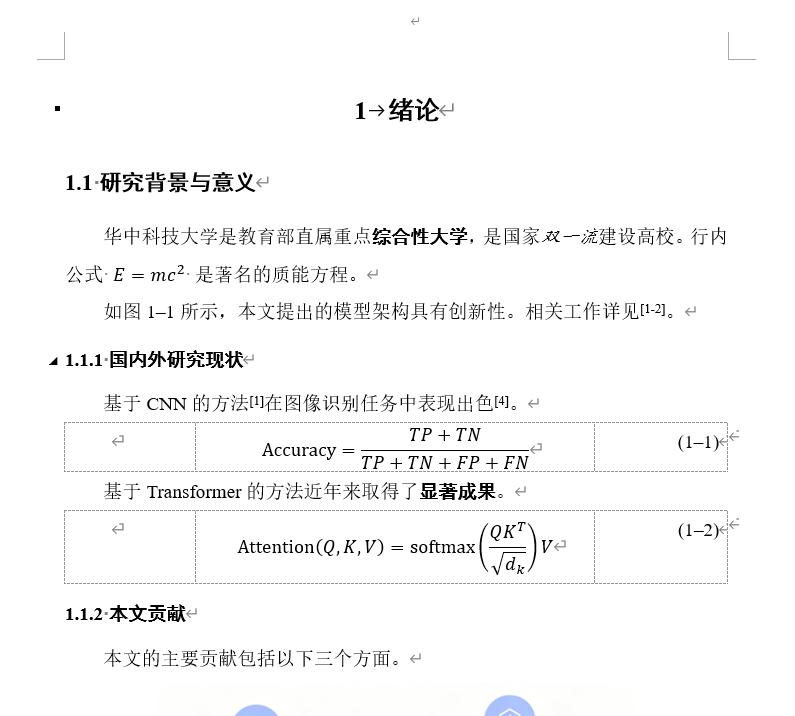

# template_mdocx · 写 Markdown，出 Word

> **让 template_mdocx 把你从重复而繁杂的排版中解放出来，你只管专注于内容。**

把写作变成聊天——你对 AI 说人话，AI 输出 Markdown，本工具一键导出为格式完美的 Word 文档。

**版本**: 0.1.0

### 不止是论文

本 MCP 服务的核心能力是 **Markdown + Word 模板 → 格式化文档**。虽然当前以华科博士论文作为测试基准，但只要你的 Word 模板样式命名清晰、排版不过于复杂（非双栏、非复杂图文混排），几乎任何规范性文档都能无缝适配：

| 文档类型 | 关键元素 | 适用度 |
| --------------- | ---------------------------------------------- | ------ |
| 学位论文 | 章节标题、三线表、公式编号、交叉引用、参考文献 | 完美 |
| 项目报告 | 标题层级、图表、公式、引用 | 完美 |
| 公文 / 红头文件 | 标题、段落、编号、落款 | 良好 |
| 技术手册 | 多级标题、表格、代码块 | 良好 |
| 申报材料 | 表格、段落、编号列表 | 良好 |
| 规章制度 | 条款编号、层级标题 | 良好 |

> 只要你的 Word 模板有规范样式名，MCP 就能匹配上。换个模板就是换种文档类型。

### 诚邀 Fork 共建

学术论文只是冰山一角。如果你有项目报告模板、公文模板、申报材料模板……欢迎 **Fork 本项目**，参考 `hust_thesis/` 的设计范式，用 **Vibecoding** 填充属于你自己领域的新模板。把话告诉 AI，让它帮你适配——就跟配 MCP 服务一样简单。大家一起把"写 Markdown 出 Word"这件事覆盖到更多场景。

---

## 效果一览



---

## 不会配环境？把这段话丢给你的 AI

你不需要自己动手安装和配置。直接打开 **Cursor / Claude Desktop / 任何支持 MCP 的 AI 工具**，把下面这段话粘贴给它，它会帮你自动完成下载、安装、配置全部流程：

---

> 帮我安装 template_mdocx 这个 MCP 服务，仓库地址是 https://github.com/cyling250/template_mdocx。请按以下步骤操作：\
>
> 1. 把仓库 clone 到本地\
> 2. 确保电脑装了 Python 3.12+ 和 uv 包管理器\
> 3. 进入项目目录，运行 `uv sync` 安装依赖\
> 4. 把这个 MCP 服务配置到我当前使用的 AI 客户端里（如果是 Cursor 就配到 Cursor，如果是 Claude Desktop 就配到 Claude Desktop），配置内容如下：\
>
> ````json\
> {\
>   "mcpServers": {\
>     "template_mdocx": {\
>       "command": "uv",\
>       "args": ["run", "--directory", "项目所在路径", "server.py"]\
>     }\
>   }\
> }\
> ```\
> 5. 安装完成后，跟我说一声，并告诉我接下来怎么用它写论文。
> ````

---

就这一句话，AI 帮你配好一切。配完之后你就能直接对话生成论文了。

---

## MCP 工具一览

| 工具 | 用途 |
|------|------|
| `help_md` | 获取服务说明和内置模板列表 |
| `example` | 获取指定模板的全局规则、局部规则和写作示例 |
| `generate` | 使用指定模板生成 Word 文档 |
| `docx_to_md` | 将已有 .docx 转回 Markdown |

### `help_md`

无需参数，返回服务简介 + 内置模板列表 + 可用工具列表。

### `example`

| 参数 | 类型 | 说明 |
|------|------|------|
| `template` | string | **必填**，模板名称，如 `hust_thesis` |

返回字段：

| 字段 | 说明 |
|------|------|
| `global_rules` | 全局规则（语法参考 + 书写约定） |
| `template_rules` | 模板局部规则（标题映射、特殊约束） |
| `example_md` | 完整写作示例 |
| `example_bib` | 示例 BIB 文献库 |
| `template_docx_path` | 模板文件路径 |

### `generate`

| 参数 | 类型 | 说明 |
|------|------|------|
| `template` | string | **必填**，模板名称，如 `hust_thesis` |
| `md_path` | string | **必填**，扩展 Markdown 文件路径 |
| `output_path` | string | 可选，输出 .docx 路径（默认与 MD 同目录） |
| `kwargs` | object | 可选，模板特定参数（如 `{"bib_path": "..."}`） |

### `docx_to_md`

| 参数 | 类型 | 说明 |
|------|------|------|
| `docx_path` | string | **必填**，输入 .docx 路径 |
| `output_md` | string | **必填**，输出 .md 路径 |
| `image_dir_name` | string | 可选，图片目录名（默认 images） |

---

## 它能做什么？

| 你做的事 | 效果 |
| -------------------------- | ------------------------ |
| 跟 AI 聊天，写出论文内容 | — |
| AI 按约定格式输出 Markdown | — |
| 一键调用本工具 | 输出格式完整的 Word 论文 |
| 在 Word 中运行一个宏 | 所有公式渲染完成 |
| `Ctrl+A` 然后 `F9` | 编号、引用全部更新 |

生成的 Word 包含：**自动编号的标题、三线表格、公式编号、图题注、交叉引用、GB/T 7714 参考文献、上标引用**。

---

## 生成后还有两件小事

生成的 `.docx` 用 Word 打开后，还有两个步骤（30 秒搞定）：

### 第一步：公式渲染

按 `Alt+F11` → `插入` → `模块`，粘贴这段代码，按 `F5` 运行：

```vba
Sub ConvertAllEquations()
    Dim eq As OMath
    For Each eq In ActiveDocument.OMaths
        On Error Resume Next
        eq.BuildUp
        On Error GoTo 0
    Next
    MsgBox "公式转换完成！", vbInformation
End Sub
```

### 第二步：刷新编号

`Ctrl+A` 全选，然后按 `F9`。所有图、表、公式、参考文献的编号和交叉引用就都刷好了。

---

## 模板可以换吗？可以！

虽然内置的是华科博士论文模板（作者是华科学生），但你完全可以换成自己的模板：

- 把样式名从 `Heading 1` 改成 `标题 1`，从 `Caption` 改成 `题注`……改几行配置就行
- 参考文献格式也可以改：从 GB/T 7714 换成 APA、MLA，或者你自定义的格式
- 具体改法看下面「二次开发」部分，或者直接告诉 AI：「帮我把华科的样式映射改成北航的」

---

## 手把手配置参考（如果你想自己来）

### Claude Desktop

**Windows** (`%AppData%\Claude\claude_desktop_config.json`)：

```json
{
  "mcpServers": {
    "template_mdocx": {
      "command": "uv",
      "args": [
        "run",
        "--directory",
        "F:\\你的路径\\template_mdocx",
        "server.py"
      ]
    }
  }
}
```

**macOS / Linux** (`~/.config/Claude/claude_desktop_config.json`)：

```json
{
  "mcpServers": {
    "template_mdocx": {
      "command": "uv",
      "args": ["run", "--directory", "/你的路径/template_mdocx", "server.py"]
    }
  }
}
```

### Cursor

```json
{
  "mcpServers": {
    "template_mdocx": {
      "command": "uv",
      "args": [
        "run",
        "--directory",
        "F:\\你的路径\\template_mdocx",
        "server.py"
      ]
    }
  }
}
```

### 手动安装

```bash
# 1. 克隆仓库
git clone https://github.com/cyling250/template_mdocx
cd template_mdocx

# 2. 安装依赖（需要 Python 3.12+ 和 uv）
uv sync

# 3. 测试一下
uv run build.py
```

---

## 扩展 Markdown 写作规范

跟 AI 说"按下面格式写论文"，它输出的内容就能直接转换。

### 标题

各模板的标题规则见对应文件：

| 模板 | 规则文件 |
|------|----------|
| `hust_thesis` | [hust_thesis/RULES.md](hust_thesis/RULES.md) |

**标题自动编号，不需要手动写入编号。**

### 行内格式

```
**粗体**    *斜体*    $E=mc^2$
```

### 插图

```
@figure[fig:标签]{图注描述}

```
- `@figure` 必须紧接在 `` 之前

### 表格

```
@table[tbl:标签]{表格名称}
| 列1 | 列2 | 列3 |
| --- | --- | --- |
| 数据 | 数据 | 数据 |
```
- `@table` 必须紧接在表格之前
- 生成三线表格式

### 块公式

```
@formula[eq:标签]
$$
公式内容
$$
```
- `@formula` 必须紧接在 `$$...$$` 之前
- 公式自动编号

### 交叉引用

```
如 @ref{fig:架构图} 所示……结果见 @ref{tbl:对比}……目标函数见 @ref{eq:损失函数}。
```
- `@ref{标签}` 的标签必须与声明的标签一致

### 文献引用

```
相关研究 @cite{resnet2016,transformer2017} 表明……
```
- `@cite{key1,key2}` 的 key 必须存在于 `.bib` 文件中

### 参考文献列表

```
@bibliography{refs.bib}
```
- 放在文档末尾，采用 GB/T 7714 格式

### 书写约定

1. **百分号前无需转义符** — 直接写 `%` 即可，无需 `\%`
2. **独立公式必须使用块公式** — 单独一行的公式必须使用 `$$...$$`，不允许使用 `$...$`
3. **单位应包裹在公式内** — 如 `$f_c=14.3$N/mm²` 应写成 `$f_c=14.3\text{N/mm}^2$`
4. **表格内的公式必须使用行内公式** — 表格中的公式使用 `$...$`，不得使用 `$$...$$`

### 四大规则

1. 每个图/表必须有 `@figure[标签]{描述}` / `@table[标签]{表名}` 声明
2. 每个块公式必须有 `@formula[标签]` 声明
3. `@ref{标签}` 的标签必须和声明的一致
4. `@cite{key}` 的 key 必须存在于 `.bib` 文件中

### 标签前缀

- `fig:` — 图片
- `tbl:` — 表格
- `eq:` — 公式

---

## 项目结构

```
RULES.md           ← 全局规则（语法参考 + 书写约定）
common/            ← 核心引擎，不碰它
hust_thesis/       ← 华科模板（你的模板也照这个写）
  ├── RULES.md     ← 模板局部规则（标题映射、特殊约束）
  ├── EXAMPLE.md   ← 完整写作示例（供 example 工具返回）
  ├── generator.py ← 样式映射 + 生成逻辑
  ├── formatters.py← 参考文献格式
  └── template.docx← Word 模板文件
```

## 二次开发：适配你自己的模板

这个项目是**模板无关的**——华科的模板只是一个示例。你可以用 Vibecoding 的方式适配任何学校的论文模板。

**把这个需求告诉 AI 就行：**

> 帮我基于 template_mdocx 适配一个新模板。我的学校是 XX 大学，Word 模板文件在 `my_template.docx`，里面用到的样式名如下：正文用 `Normal`，标题用 `标题1`、`标题2`，题注用 `题注`，参考文献用 `参考文献`。请参考 `hust_thesis/` 目录下的实现方式，帮我创建一个 `my_univ/` 模块。

核心要改的只是 [generator.py](hust_thesis/generator.py) 里的样式映射：

```python
_STYLE_MAP = {
    "body": "Normal",        # ← 改成你模板里的正文样式名
    "heading_1": "Heading 1", # ← 改成你模板里的一级标题样式名
    "heading_2": "Heading 2",
    "caption": "Caption",
    "bibliography": "Bibliography",
}
```

添加新模板后在 `server.py` 的 `_BUILTIN_TEMPLATES` 注册表中添加即可，无需新增工具。

---

## 环境要求

- Python >= 3.12
- [uv](https://docs.astral.sh/uv/)（一行命令安装：`pip install uv`）

## 许可证

Apache-2.0
